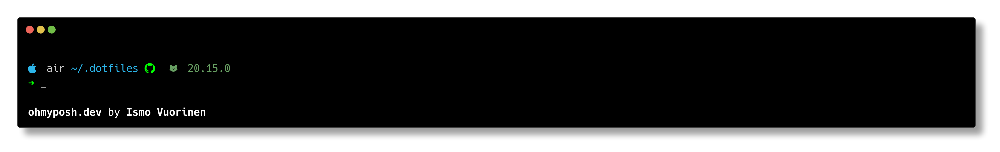

# .dotfiles

Welcome to [ivuorinen](https://github.com/ivuorinen)'s .dotfiles repository.
It's a hodgepodge of scripts and configurations, tests and mistakes I'm not
aware of yet. As I find more interesting tools, configs and other stuff,
this repository will live accordingly.

Please for the love of everything good do not use these 1:1 as your own dotfiles,
fork or download the repo as a zip and go from there with your own configs.

It would be nice if you'd add an issue linking to your fork or repo so I can
see what interesing stuff you've done with it. Sharing is caring.

## Setup

### First time setup

1. Clone this repository to `$HOME/.dotfiles`
2. `./install`
3. ???
4. Profit

### Updates

`cd $HOME/.dotfiles && git pull && ./install`

## The looks

## Interesting files and locations

### Interesting folders

| Path                | Description                                  |
| ------------------- | -------------------------------------------- |
| `.github`           | GitHub Repository configuration files, meta. |
| `hosts/{hostname}/` | Configs that should apply to that host only. |
| `local/bin`         | Helper scripts that I've collected or wrote. |
| `scripts`           | Setup scripts.                               |

### dotfile folders

| Repo      | Destination | Description                                 |
| --------- | ----------- | ------------------------------------------- |
| `base/`   | `.*`        | `$HOME` level files.                        |
| `config/` | `.config/`  | Configurations for applications.            |
| `local/`  | `.local/`   | XDG Base folder: `bin`, `share` and `state` |
| `ssh/`    | `.ssh/`     | SSH Configurations.                         |

### dfm - the dotfiles manager

[`.local/bin/dfm`][dfm] is a shell script that has some tools that help with dotfiles management.

Running `dfm` gives you a list of available commands.

## Configuration

The folder structure follows [XDG Base Directory Specification][xdg] where possible.

### XDG Variables

| Env                | Default              | Short description                              |
| ------------------ | -------------------- | ---------------------------------------------- |
| `$XDG_BIN_HOME`    | `$HOME/.local/bin`   | Local binaries                                 |
| `$XDG_CONFIG_HOME` | `$HOME/.config`      | User-specific configs                          |
| `$XDG_DATA_HOME`   | `$HOME/.local/share` | User-specific data files                       |
| `$XDG_STATE_HOME`  | `$HOME/.local/state` | App state that should persist between restarts |

Please see [docs/folders.md][docs-folders] for more information.

[dfm]: https://github.com/ivuorinen/dotfiles/blob/main/local/bin/dfm
[docs-folders]: https://github.com/ivuorinen/dotfiles/blob/main/docs/folders.md
[xdg]: https://specifications.freedesktop.org/basedir-spec/basedir-spec-latest.html
