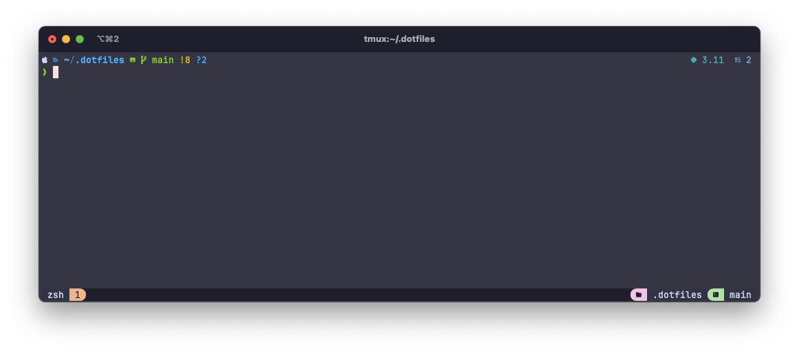
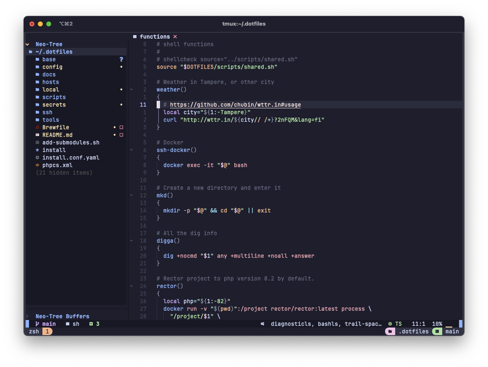

# .dotfiles

Welcome to [ivuorinen](https://github.com/ivuorinen)'s .dotfiles repository.
It's a hodgepodge of scripts and configurations, tests and mistakes I'm not
aware of yet. As I find more interesting tools, configs and other stuff,
this repository will live accordingly.

Please for the love of everything good do not use these 1:1 as your own dotfiles,
fork or download the repo as a zip and go from there with your own configs.

## Setup

### First time setup

1. Clone this repository to `$HOME/.dotfiles`
2. `./install`
3. ???
4. Profit

### Updates

`cd $HOME/.dotfiles && git pull && ./install`

## The looks

## tmux with powerlevel10k, the default view

## tmux + nvim (astronvim) editing this repository

## Interesting files and locations

### Interesting folders

| Path                | Description                                  |
|---------------------|----------------------------------------------|
| `.github`           | GitHub Repository configuration files.       |
| `hosts/{hostname}/` | Configs that should apply to that host only. |
| `local/bin`         | Helper scripts that I've collected or wrote. |
| `scripts`           | Setup scripts.                               |

### dotfile folders

| Repo      | Destination | Description                                 |
|-----------|-------------|---------------------------------------------|
| `base/`   | `.*`        | `$HOME` level files.                        |
| `config/` | `.config/`  | Configurations for applications.            |
| `local/`  | `.local/`   | XDG Base folder: `bin`, `share` and `state` |
| `ssh/`    | `.ssh/`     | SSH Configurations.                         |

### dfm - the dotfiles manager

`.local/bin/dfm` is a shell script that has some tools that help with dotfiles management.

## Configuration

The folder structure follows [XDG Base Directory Specification][xdg] where possible.

### XDG Variables

| Env                | Default              | Short description                              |
|--------------------|----------------------|------------------------------------------------|
| `$XDG_BIN_HOME`    | `$HOME/.local/bin`   | Local binaries                                 |
| `$XDG_CONFIG_HOME` | `$HOME/.config`      | User-specific configs                          |
| `$XDG_DATA_HOME`   | `$HOME/.local/share` | User-specific data files                       |
| `$XDG_STATE_HOME`  | `$HOME/.local/state` | App state that should persist between restarts |

- `$XDG_BIN_HOME` defines directory that contains local binaries.
- `$XDG_DATA_HOME` defines the base directory relative to which user-specific data
  files should be stored.
  - If `$XDG_DATA_HOME` is either not set or empty, a default equal to
    `$HOME/.local/share` should be used.
- `$XDG_CONFIG_HOME` defines the base directory relative to which user-specific
  configuration files should be stored.
  - If `$XDG_CONFIG_HOME` is either not set or empty, a default equal to `$HOME/.config` should be used.
- `$XDG_STATE_HOME` defines the base directory relative
  to which user-specific state files should be stored.
  - If `$XDG_STATE_HOME` is either not set or empty, a default equal to `$HOME/.local/state` should be used.
- The `$XDG_STATE_HOME` contains state data that should persist between (application) restarts,
  but that is not important or portable enough to the user that it should be stored in `$XDG_DATA_HOME`.
  - It may contain:
    - actions history (logs, history, recently used files, …)
    - current state of the application that can be reused
      on a restart (view, layout, open files, undo history, …)
- User-specific executable files may be stored in `$HOME/.local/bin`.
  Distributions should ensure this directory shows up in the UNIX `$PATH`
  environment variable, at an appropriate place.
- `$XDG_DATA_DIRS` defines the preference-ordered set of base directories
  to search for data files in addition to the `$XDG_DATA_HOME` base directory.
  The directories in `$XDG_DATA_DIRS` should be seperated with a colon ':'.

[xdg]: https://specifications.freedesktop.org/basedir-spec/basedir-spec-latest.html
